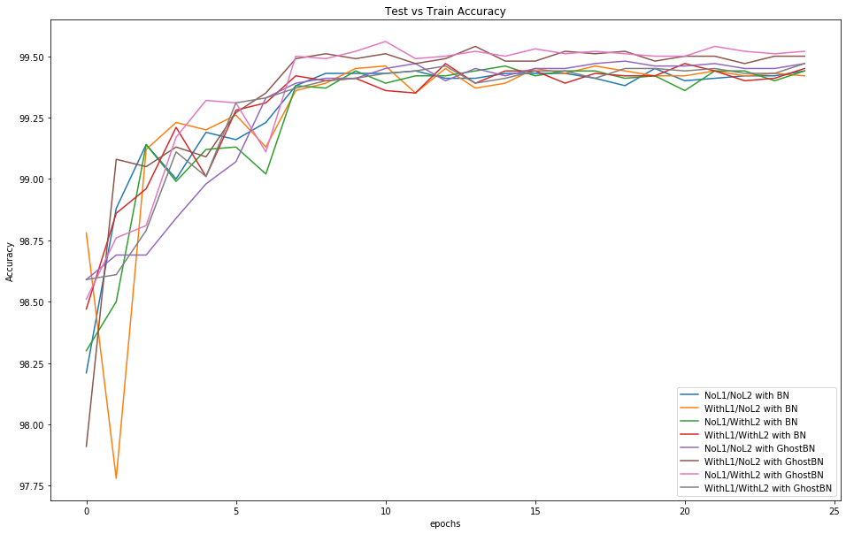
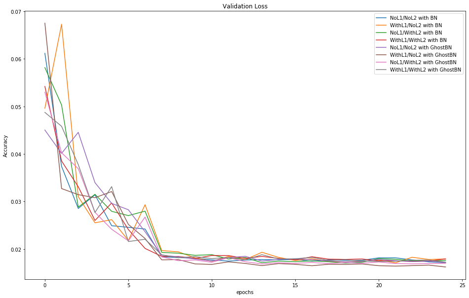

<b> Group Members:</b>  
[Jahnavi Ramagir](https://canvas.instructure.com/courses/1804302/users/25685093)  
[Madalasa Venkataraman](https://canvas.instructure.com/courses/1804302/users/25685106)  
[Sachin Sharma](https://canvas.instructure.com/courses/1804302/users/23724529)  
[Syed Abdul Khader](https://canvas.instructure.com/courses/1804302/users/25685109)  

<i>Colab file:</i> https://github.com/shan2312/EVA4/blob/master/s6/EVA4S6.ipynb  
In order to run the model we need to upload all the neccessary packages to the colab directory. The packages can be found in the S6 folder of EVA4 repo.  

<b>Objectives</b>
Run your model for 25 epochs for each:
1. without L1/L2 with BN
2. without L1/L2 with GBN
3. with L1 with BN
4. with L1 with GBN
5. with L2 with BN
6. with L2 with GBN
7. with L1 and L2 with BN
8. with L1 and L2 with GBN 

<b> Finding the Optimal Lambda values for L1 and L2 regularization:</b>  
<i>For L1:</i>  
Values checked for 1e-5, 5e-5, 0.0001, 0.0005, 0.001, 0.05 
 
The value of 1e-5 gave the best validation accuracy.  

<i>For L2:</i>  
 
Values checked for 1e-5, 5e-5, 0.0001, 0.0005, 0.001, 0.05
Here as well the Lambda value of 1e-5 gave the best validation accuracy.

Hence, in the model we used the lamda value of 1e-5 for both L1 and L2 
<b>Validation accuracy curves for all 8 tasks:</b> 
 
<b>Validation Loss curves for all 8 tasks:</b> 
 
<b> Misclassified images for L1/L2 with BN:</b> 
 
<b> Misclassified images for L1/L2 with GBN:</b> 

